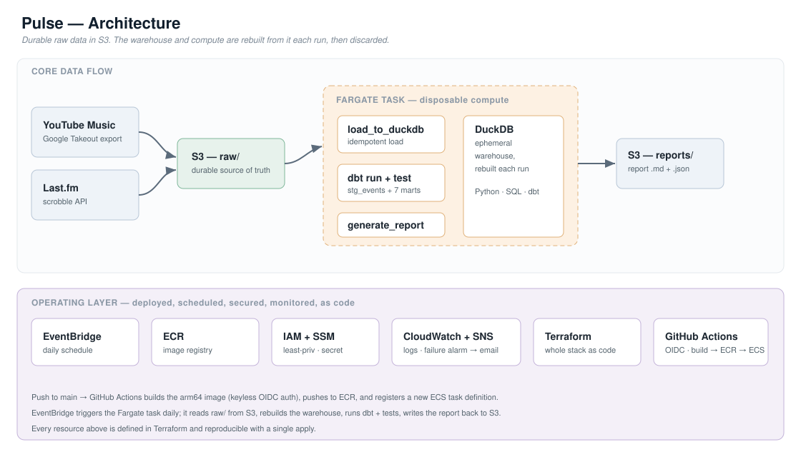
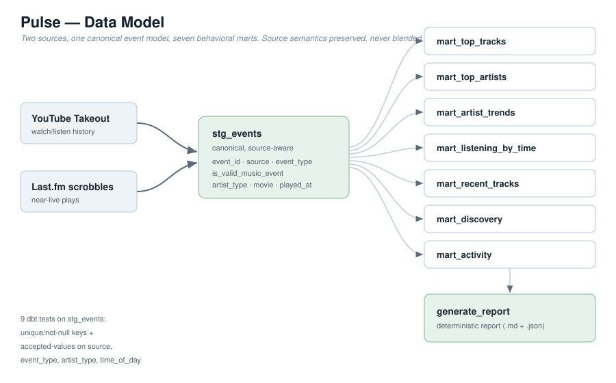

# Pulse — Multi-Source Listening Data Platform

A platform-independent data platform that unifies fragmented listening history from
independent sources into a single, source-aware analytical model — containerized,
scheduled, secured, monitored, and deployed on AWS entirely from code.

Streaming services each analyze only their own ecosystem. Pulse solves the
**fragmentation** problem: it ingests listening history from separate sources
(YouTube Music via Google Takeout, and Last.fm scrobbles), normalizes them into one
canonical event model that *preserves each source's semantics*, and derives long-term
behavioral analytics — top artists and tracks, listening rhythm, discovery-vs-repeat
behavior, and trends over time.

> **Scope, stated honestly.** At ~9,000 events this is not a big-data workload, and it
> does not pretend to be. Pulse is built to demonstrate *correct, operable* data
> engineering — idempotent ingestion, source-aware modeling, data-quality testing, and
> full cloud operation — right-sized to the data rather than dressed up with distributed
> tooling it doesn't need. Every claim below points to the file or config that proves it.

**Stack:** Python · SQL · dbt · DuckDB · Docker · AWS (S3 · ECR · Fargate · EventBridge · IAM · SSM · CloudWatch · SNS) · Terraform · GitHub Actions

---

## Architecture



The central design decision is **durable data, disposable compute.** S3 holds the raw
listening history as the permanent source of truth. On every run, an ephemeral Fargate
task rebuilds the entire DuckDB warehouse from that raw data, runs the dbt models and
tests, writes the report back to S3, and disappears. This is safe *because* ingestion is
idempotent and the transformations are deterministic — rebuilding from raw always
produces an identical warehouse. There is no server, volume, or state to manage.

## Data model



Two sources with genuinely different semantics (Last.fm scrobbles are near-live
individual plays; YouTube Takeout is watch history that includes non-music content) are
normalized into one canonical `stg_events` model — which classifies music vs. non-music,
distinguishes real artists from labels/channels, and extracts the film/album where a
track names it. Seven behavioral marts build on that single model. Sources are kept as a
dimension so analytics can segment or combine them, but are **never blended blindly.**

---

## What it produces

The pipeline emits a deterministic report (Markdown + JSON) built entirely from the
marts — no LLM, always reproducible. An anonymized, structure-preserving example is in
[`reports/sample_report.md`](reports/sample_report.md) (real names are not published):

```
## Top musicians (all time)   — labels/channels excluded
1. Artist A — 300 plays       4. Artist D — 180 plays
2. Artist B — 285 plays       5. Artist E — 170 plays
3. Artist C — 230

## Top tracks (all time)
2. Track 02 — Movie X — Artist C (90)   # movie/album label extracted from the title

## This month
- N plays / D active days · XX% new discoveries, YY% repeats
```

---

## Engineering decisions

The stack is ordinary; the decisions are the point.

**Source-aware semantics.** Last.fm and YouTube Takeout do not represent listening
identically. Rather than concatenating them, the canonical model preserves `source` and
classifies each event, so a metric can choose the clean signal (e.g. `mart_recent_tracks`
defaults to the YouTube source because scrobbles carry noisier non-music content).

**Idempotent rebuilds.** Testing exposed a double-load that had inflated the table by
~27% (the same event under two differently-parsed timestamps). The loader was rewritten to
de-duplicate on a composite key so repeated runs converge to the same result — which is
what makes disposable compute safe. See [`ingestion/load_to_duckdb.py`](ingestion/load_to_duckdb.py).

**Durable raw / disposable warehouse.** At this volume, rebuilding DuckDB costs seconds,
so S3 stays durable and the Fargate task + warehouse are thrown away each run — no
persistent infrastructure to operate.

**Mood classification abandoned on evidence.** The project originally aimed to classify
track mood. Three external sources were tried (Spotify audio features, AudD, Last.fm tags)
and none had usable coverage for a predominantly Telugu/Tamil/Hindi catalog. Rather than
ship unreliable labels, the feature was removed and the product refocused on behavioral
analytics the data *can* support. The removal is the honest result of hypothesis → test →
evidence → decision.

**Right-sized cloud.** No Kubernetes, Redshift, MWAA, or NAT gateway — each was
consciously rejected because it solves no problem this workload has. Fargate over Lambda
was chosen so the dbt/DuckDB container packages cleanly; a public subnet avoids the
~$32/mo NAT-gateway trap.

---

## Data pipeline & modeling

`fetch_tracks.py` / `parse_takeout.py` → raw JSON in S3 → `load_to_duckdb.py` (idempotent)
→ **dbt**: `stg_events` (canonical, source-aware) → 7 marts → `generate_report.py`.

The marts: `mart_top_tracks`, `mart_top_artists`, `mart_artist_trends`,
`mart_listening_by_time`, `mart_recent_tracks`, `mart_discovery`, `mart_activity` —
all source-aware, in [`pulse_dbt/models/`](pulse_dbt/models/).

## Cloud operations

Defined entirely in [`terraform/`](terraform/): ECR, ECS/Fargate, IAM roles (least
privilege), SSM (the one secret), EventBridge (daily schedule), CloudWatch, SNS. The
stack was built manually first to understand every component, then codified in Terraform
and **rebuilt from scratch** to verify reproducibility. Deployment is automated by
[GitHub Actions](.github/workflows/deploy.yml): a push to `main` builds the arm64 image
(keyless auth via OIDC — no stored credentials), pushes to ECR, and registers a new ECS
task definition.

## Reliability & data quality

- **Idempotent ingestion** — re-running does not duplicate data (composite-key de-dup).
- **9 dbt tests** on `stg_events` — uniqueness/not-null on keys, and accepted-values on
  `source`, `event_type`, `artist_type`, `time_of_day`. See [`pulse_dbt/models/staging/stg_events.yml`](pulse_dbt/models/staging/stg_events.yml). The container runs `dbt test` on every execution and fails the run on a violation.
- **Monitoring** — CloudWatch log metric filter + alarm → SNS email on any pipeline error.

---

## Engineering challenges (discovered by testing, not assumed)

- **Silent half-loaded data.** The original loader only ever loaded the Takeout source; the
  Last.fm scrobbles had never actually made it into the warehouse. Caught by comparing row
  counts to reality, then fixed to load both sources correctly.
- **Double-load inflation.** A second load path had duplicated ~2,500 events under
  differently-parsed timestamps; fixed with a composite-key rebuild from raw.
- **Timestamp parsing.** Takeout timestamps (`"May 31, 2026, 5:13:56 PM CDT"`) need
  timezone-aware parsing; a rigid parser silently dropped 9,000+ rows until corrected.
- **Content vs. container.** YouTube "Music" history includes trailers, reactions and BGM;
  `is_valid_music_event` is an honest best-effort content filter, not a claim of perfection.

## Verified results

| What | Value | Verified by |
|---|---|---|
| Sources unified | 2 (YouTube Takeout + Last.fm) | `stg_events.source` |
| Events | ~9K, source-aware | `load_to_duckdb.py` output |
| History span | multi-year, ~700+ active days | `mart_activity` |
| dbt tests | 9, run on every execution | `pulse_dbt/models/staging/stg_events.yml` |
| Behavioral marts | 7 | `pulse_dbt/models/marts/` |
| Movie/album extraction | best-effort from track titles | `stg_events.movie` |
| Cloud run | Fargate task exits 0; report written to S3 | CloudWatch logs |

*(Exact event counts grow as history is re-exported; figures above describe the system, not a frozen snapshot.)*

---

## Project structure

```
Pulse/
├── ingestion/              # fetch_tracks, parse_takeout, load_to_duckdb (idempotent)
├── ingestion/generate_report.py   # deterministic report from the marts
├── pulse_dbt/
│   └── models/
│       ├── staging/        # stg_events (canonical, source-aware) + 9 tests
│       └── marts/          # 7 behavioral marts
├── terraform/              # full AWS stack as code (S3 referenced, not managed)
├── .github/workflows/      # CI/CD: build → ECR → ECS (OIDC)
├── reports/sample_report.md
├── docs/                   # architecture + data-model diagrams
├── Dockerfile              # arm64; installs awscli for S3 sync
├── entrypoint.sh           # sync raw <- S3, run pipeline, sync report -> S3
└── run_pipeline.sh         # local runner
```

## Running locally

The container is S3-aware (it syncs raw data from S3 and the report back up), so running
it locally uses your AWS credentials and bucket:

```bash
git clone https://github.com/charanlokku15/Pulse.git && cd Pulse
docker build -t pulse-pipeline .
docker run --rm \
  -e S3_BUCKET="pulse-data-<account-id>" \
  -e AWS_DEFAULT_REGION="us-east-1" \
  -v "$HOME/.aws:/root/.aws:ro" \
  pulse-pipeline
```

To run the pipeline **without any cloud** (local raw JSON in `data/raw/`, no S3):

```bash
python -m venv venv && source venv/bin/activate
pip install -r requirements.txt
bash run_pipeline.sh    # load -> dbt run -> dbt test -> report, all local
```

## AWS deployment

```bash
cd terraform
cp terraform.tfvars.example terraform.tfvars   # add your Last.fm key (gitignored)
terraform init && terraform apply
```

Then push the image to the created ECR repo (or just `git push` — CI/CD handles it).
The whole stack is **~$1/month** (a daily ~45-second Fargate run, a few MB in S3), and
`terraform destroy` returns it to $0 between demos.

## Limitations & trade-offs

- **Not big data** — deliberately. The value shown is design and operation, not scale.
- **Recency is bounded by ingestion.** Takeout is clean but only fresh at export time;
  Last.fm is live but sparse. "Freshness is a property of the pipeline, not the query" is
  treated as a design fact, not hidden.
- **Content classification is best-effort.** Title-based filtering can't perfectly separate
  music from other YouTube content; the flag is honest, not exact.
- **`frontend/` is a deprecated prototype** from the project's original direction and is not
  maintained; the report artifact is the current output.

## Future work

- Add a source adapter for another provider (Spotify / Apple Music) — the canonical model
  is built so a new source is an extension, not a redesign.
- Cross-source entity resolution (matching the same track across sources).
- Optional LLM enrichment as a *non-critical* layer that can fail without breaking the core.

Personalized recommendations are intentionally **out of scope** — that is a separate
machine-learning problem, and Pulse is a data-engineering platform.
