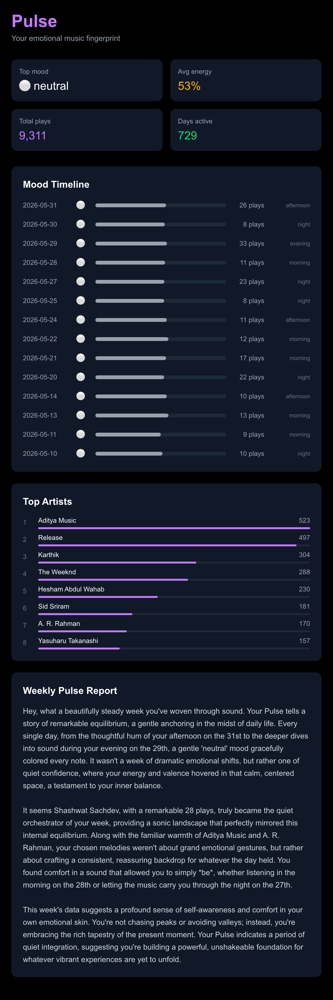

# Pulse

> A real-time music emotional intelligence pipeline.

Pulse ingests your listening history, models your emotional patterns over time, and generates a personalized weekly report — all powered by a production-grade data engineering pipeline running on real data.

**Live:** [pulse-nu-black.vercel.app](https://pulse-nu-black.vercel.app)

---

## Dashboard



---

## What it does

Every song you listen to carries an emotional signal — energy, mood, tempo, valence. Pulse collects those signals across your full listening history, runs them through a data pipeline, and builds a living emotional fingerprint of how you listen.

The result is a weekly report that feels less like a dashboard and more like someone who actually understands your taste. Not "you listened to 47 songs" — but "you went 68% melancholic by Wednesday, anchored by Hesham Abdul Wahab, and came back up by the weekend."

---

## Architecture

```
YouTube Music → Last.fm API → fetch_tracks.py
                                    ↓
Google Takeout → parse_takeout.py   ↓
                        ↓           ↓
                   data/raw/*.json ←┘
                        ↓
              load_to_duckdb.py → DuckDB warehouse
                        ↓
            dbt transformations (stg_listening_events, stg_daily_mood)
                        ↓
            fetch_audio_features.py → mood classification per track
                        ↓
            build_embeddings.py → 20-dim emotional fingerprint
                        ↓
            generate_pulse_report.py → Gemini LLM weekly report
                        ↓
            Next.js dashboard → deployed on Vercel
```

The full pipeline runs automatically every day at 9am via cron.

---

## Tech stack

| Layer | Tool | Purpose |
|---|---|---|
| Ingestion | Python, Last.fm API | Fetch real-time scrobbles |
| Data lake | Local JSON files | Raw event storage |
| Warehouse | DuckDB | Analytical queries on listening data |
| Transformation | dbt Core | SQL models, tests, data quality |
| Audio features | AudD API + heuristics | Mood classification per track |
| Embeddings | NumPy, scikit-learn | 20-dim user behavioral fingerprint |
| LLM layer | Gemini API | Weekly personalized report generation |
| Orchestration | Cron | Daily automated pipeline |
| Frontend | Next.js + Tailwind CSS | Dashboard displaying mood and insights |
| Deployment | Vercel | Live hosting |

---

## Data

- **9,311 real listening events** from YouTube Music via Last.fm and Google Takeout
- **729 days** of listening history
- **2,209 tracks** classified with mood labels (energetic, melancholic, peaceful, neutral)
- **20-dimensional** emotional fingerprint updated daily

---

## Running locally

**Prerequisites:** Python 3.11+, Node.js 18+, Last.fm API key, Gemini API key

```bash
# Clone the repo
git clone https://github.com/charanlokku15/Pulse.git
cd Pulse

# Set up Python environment
python -m venv venv
source venv/bin/activate
pip install -r requirements.txt

# Add your credentials
# Create a .env file with:
# LASTFM_API_KEY=your_key
# LASTFM_USERNAME=your_username
# GEMINI_API_KEY=your_key
# AUDD_API_KEY=your_key

# Run the full pipeline
bash run_pipeline.sh

# Start the frontend
cd frontend
npm install
npm run dev
# Open localhost:3000
```

---

## Key engineering challenges

**Spotify API deprecation** — Spotify killed audio features for new developers in November 2024 mid-build. Switched to Last.fm and AudD as open alternatives. Built the pipeline so data sources are swappable without changing downstream models.

**Messy source data** — YouTube Music sends playlist titles as artist names instead of real artists. Built a dbt transformation layer that detects and cleans playlist-as-artist patterns, flags them as Unknown Artist, and preserves the raw original for reference.

**HTML parsing at scale** — Google Takeout exports a 67MB single-line HTML file. Standard BeautifulSoup parsing hung indefinitely. Switched to a regex-based approach that processes the file in under 2 seconds. Root cause: a non-breaking space character `\xa0` between HTML elements that standard patterns didn't match.

---

## Project structure

```
pulse/
├── ingestion/              # Python pipeline scripts
│   ├── fetch_tracks.py         # Last.fm API ingestion
│   ├── parse_takeout.py        # Google Takeout parser
│   ├── load_to_duckdb.py       # Warehouse loader
│   ├── fetch_audio_features.py # Mood classification
│   ├── build_embeddings.py     # User fingerprint
│   └── generate_pulse_report.py # LLM weekly report
├── pulse_dbt/              # dbt transformation layer
│   └── models/staging/         # SQL models and tests
├── dags/                   # Airflow DAG definition
├── frontend/               # Next.js dashboard
├── docs/                   # Screenshots
├── run_pipeline.sh         # Daily cron pipeline script
└── requirements.txt        # Python dependencies
```

---

## Roadmap

- [ ] Multi-user support with Supabase auth
- [ ] Taste Tribe — match users by emotional fingerprint similarity
- [ ] Trend Radar — detect tracks spreading through taste clusters before they chart
- [ ] Streaming ingestion replacing batch polling
- [ ] Migration to BigQuery for production scale